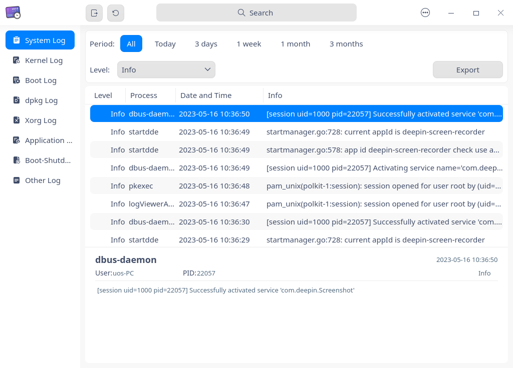
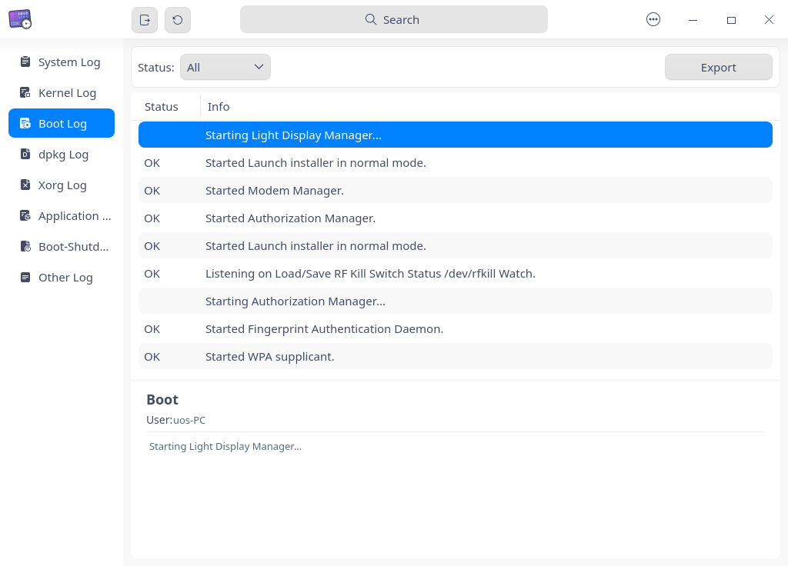
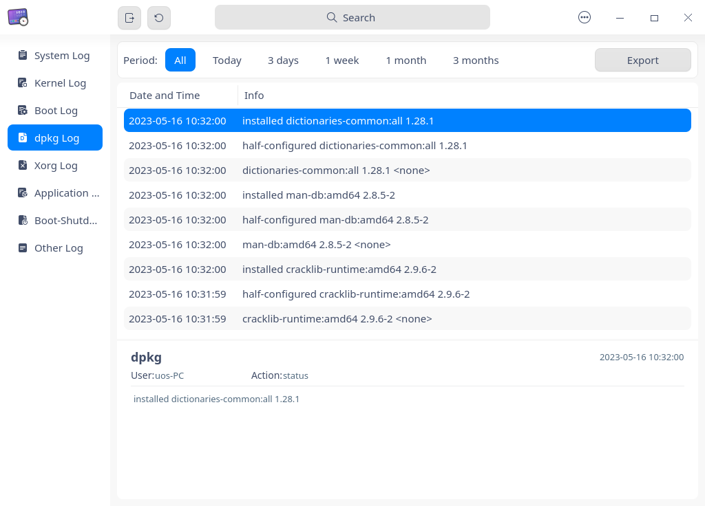
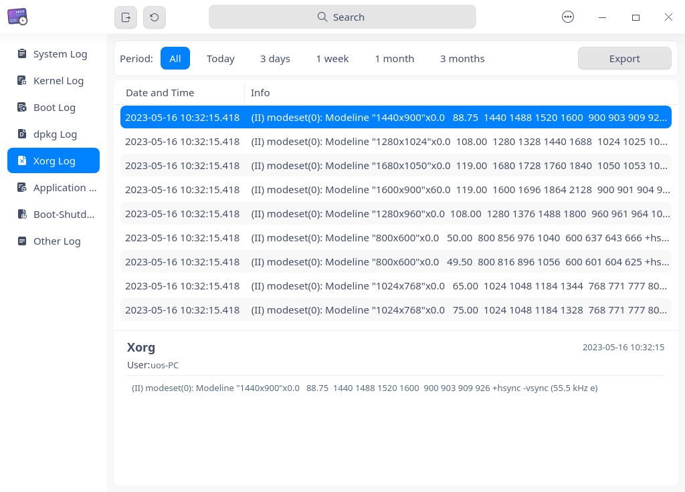
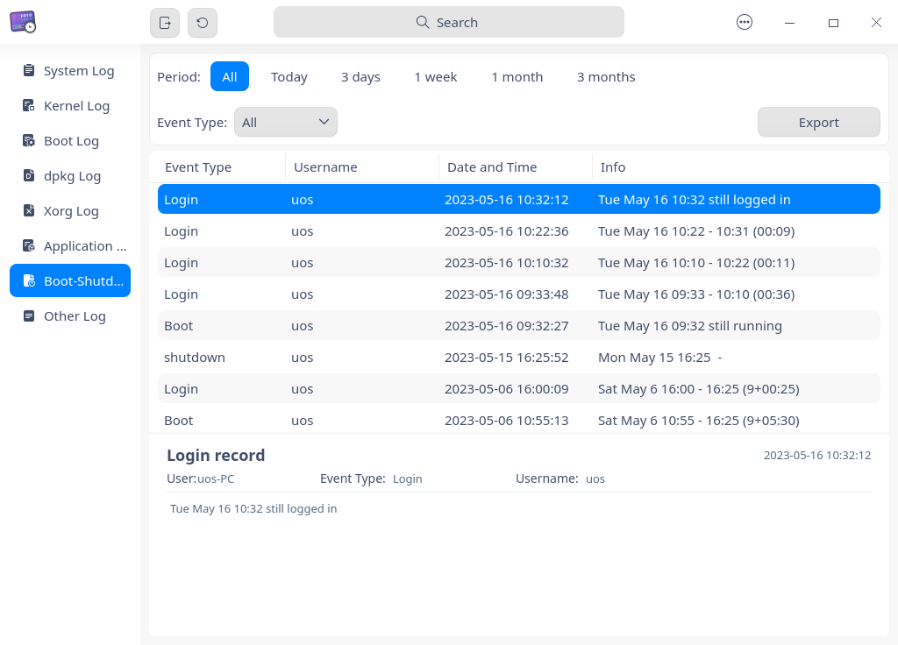

# Log Viewer|deepin-log-viewer|

## Overview 

Log viewer is a tool that collects logs generated when an application is running, for example, logs generated when operating system and applications start up and run. You can do trouble-shooting and solve problems quickly by analyzing logs. 

## Guide

You can run, close or create a shortcut for Log Viewer.

### Run Log Viewer 

1. Click on the Dock to enter the interface of launcher.
2. Locate  by scrolling the mouse wheel or searching "Log Viewer" in the Launcher interface and click it to run.
3. Right-click to:
   - Select **Send to desktop** to create a shortcut on the desktop.

   - Select  **Send to dock** to fix it onto the dock.

   - Select **Add to startup** to run it automatically when the computer is turned on.

### Exit Log Viewer 

- On the main interface, click   to exit.
- Right-click  on the Dock, select **Close all** to exit.
- On interface of Log Viewer, click  and select **Exit** to exit.

## Operations

### Search

1. Clickin the search box.
2. Input keywords. And the results are displayed after input. 
3. Click  to clear up current searching.

### Filter

 Filtering parameters include **period**, **level**, **status**, **application list** and **event type**.

<table border="1">
   <tr>
    <th>Filtering Type</th>
 <th>Description </th>
</tr>
   <tr>
    <td>Filtering by period</td>
    <td>to filter in the order of log generating date
      <ul>
          <li>Options include: "All", "Today", "3 days", "1 week", "1 month", and "3 months". Default option is "All".</li>
          <li>Applicable for: "period" is not displayed only for boot logs, other kinds of logs support filtering by period.</li>
      </ul>
 </td>
</tr>
   <tr>
    <td>Filtering by level</td>
    <td>to filter by seriousness levels of events
    <ul>
          <li>Options include: "All", "Emergency", "Alert", "Critical", "Error", "Warning", "Notice", "Info"and "Debug". Default option is "Info".</li>
          <li>Applicable for: system logs and application logs</li>
      </ul>
      <tr>
    <td>Filtering by status</td>
    <td>
    <ul>
          <li>Options include: "All", "OK", and "Failed". Default option is "All".</li>
          <li>Applicable for: boot logs only</li>
      </ul>
          <tr>
    <td>Filtering by application list: </td>
    <td>to filter log files of applications, default option is the first one. 
        Applicable for: application logs only.  </td>
              <tr>
    <td>Filtering by event type</td>
    <td>
    <ul>
          <li>Options include:  "All", "Login", "Reboot", and "Shutdown", the default option is "all".  </li>
          <li>Applicable for: boot-shutdown events only.</li>
      </ul>
 </td>
   </tr>
   </table>

### View Logs

#### System Log

1. On the main interface, click **System Log**. 
2. You can see a list of system logs which are detailed by "Level", "Process", "Date and Time", and "Info".
3. Click a log, you can see its particular info below the list, including process, time, user, PID, level and info.

#### Kernel Log

1. On the main interface, click  **Kernel Log**.
2. Input login password in the pop-up authentication window. 
3. You can view the status and information of kernel logs.
4. Click a log, you can see its particular info below the list, including process, time, user and info.

#### Boot Log

1. On the main interface, click **Boot Log**.
2. Input password in the popped up authentication window. 
3. You can view the status and information of boot logs.
4. Click a log, you can see its particular info below the list, including user, status and info.

#### dpkg Log

1. On the main interface, click **dpkg Log**. 
2. You can view time and information of dpkg logs.
3. Click a log, you can see its particular info below the list, including time, user, action and info.

#### Xorg Log

1. On the main interface, click **Xorg Log**.
2. You can view time and information of Xorg logs.
3. Click a log, you can see its particular info below the list, including user, time and info.

#### Application Log

1. On the main interface, click  **Application Log**.
2. You can view level, time, source and information of application logs.
3. Click a log, you can see its particular info below the list, including source, user, time, level and info.

#### Boot-Shutdown Event

1. On the main interface, click  **Boot-Shutdown Event**.
2. You can view event type, username, time and information of boot-shutdown events.
3. Click a log, you can see its particular info below the list, including user, time, event type, username and info.

### Export Logs

You can export logs to local computer so as to help you analyze, locate and solve problems.

1. Select a log type and click **Export** in the upper right corner. 
2. Input login password in the pop-up authentication window (if any) and click **Confirm**.
3. Select the storing path in the pop-up window, and click **Save**.

> Notes: you can also click the "Export All" button  on the title bar to export system logs, kernel logs, boot logs, dpkg logs, Xorg logs, application logs and logs of boot-shutdown events as well.

### Refresh

You can refresh the logs manually and automatically. For auto refresh, you can set the frequency.

#### Manual Refresh

Click the "Refresh Now" button  on the title bar, or right-click on a log type and select **Refresh** to reload the log list.

#### Auto Refresh

1. Click  > **Refresh interval** in the main interface.
2. Select a proper refresh interval from **10 sec**, **1 min**, and **5 min**. Or select **No refresh** to stop auto refreshing.

### Display in File Manager

**Display in file manager** is only applicable for kernel log, boot log, dpkg log, Xorg log and application log.

1. On the interface of Log Viewer, select a log type in the left panel and right-click.
2. Select **Display in file manager**, the folder path of the current log will be opened. 

### Clear Log

**Clear log** is only applicable for kernel log, boot log, dpkg log, Xorg log and application log.

1. On the interface of File Manager, select a log type in the left panel and right-click.
2. Select **Clear log**, click **Confirm** button in the pop-up window to clear current logs.
3. If authentication window pops up, please input password to finish the operation.

## Main Menu

In the main menu, you can [set refresh intervals](#Auto Refresh), switch themes, view help manual, and so on.

### Theme

The window theme includes Light Theme, Dark Theme and System Theme.

1. Click on the interface.
2. Click **Theme** to select one.

### Help

Click Help to get the manual, which will help you further know and use Log Viewer.

1. Click on the interface.
2. Click **Help** to view the manual.

### About

1. Click on the interface.
2. Click **About** to view version information and introduction about Log Viewer.

### Exit

1. Click on the interface.
2. Click  **Exit**.

