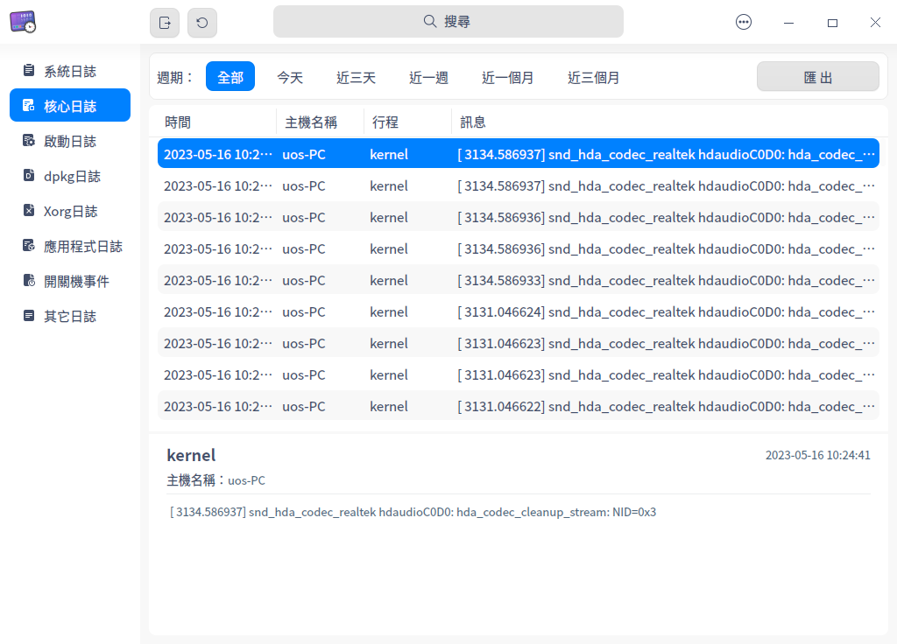
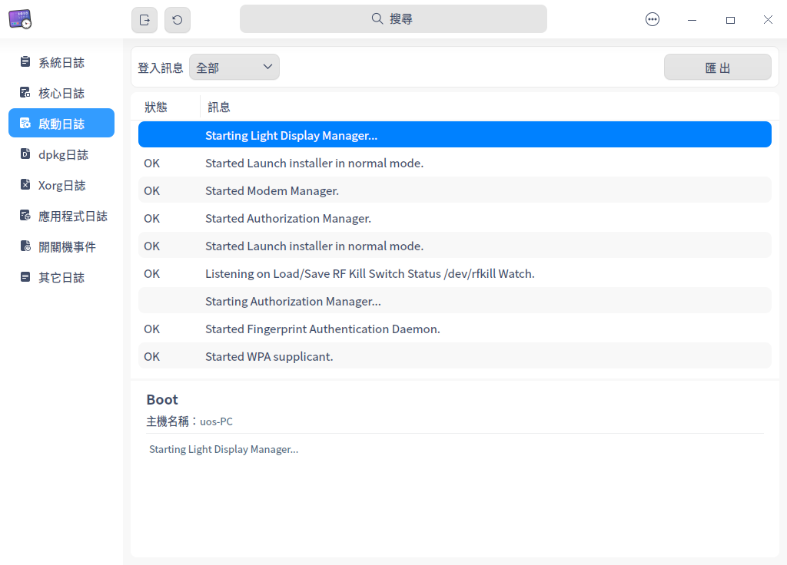
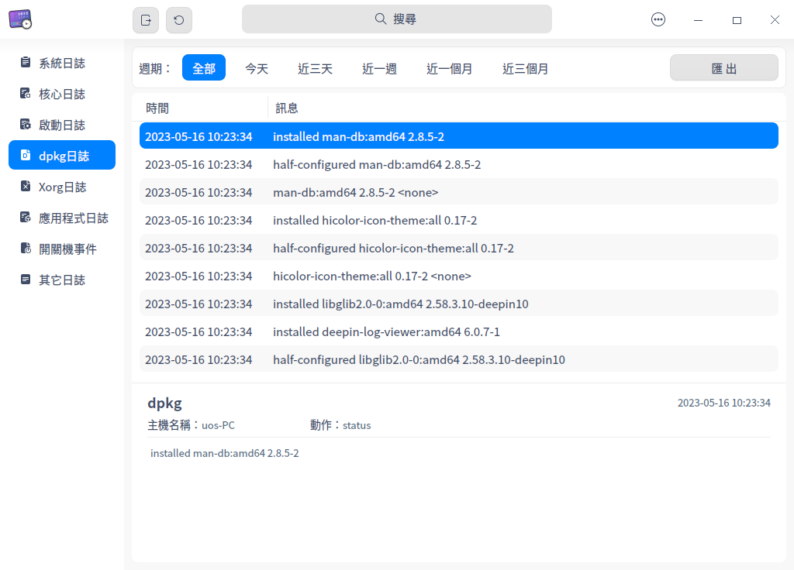
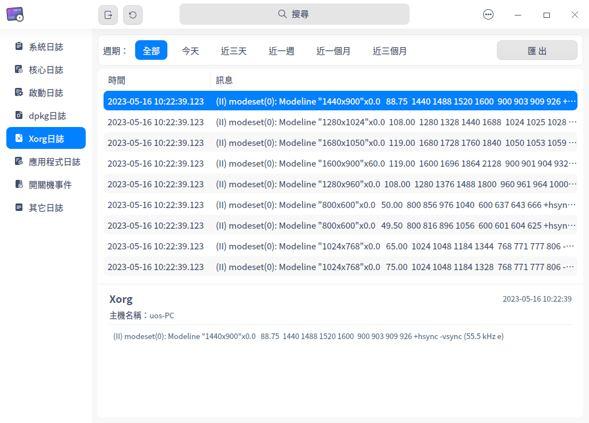
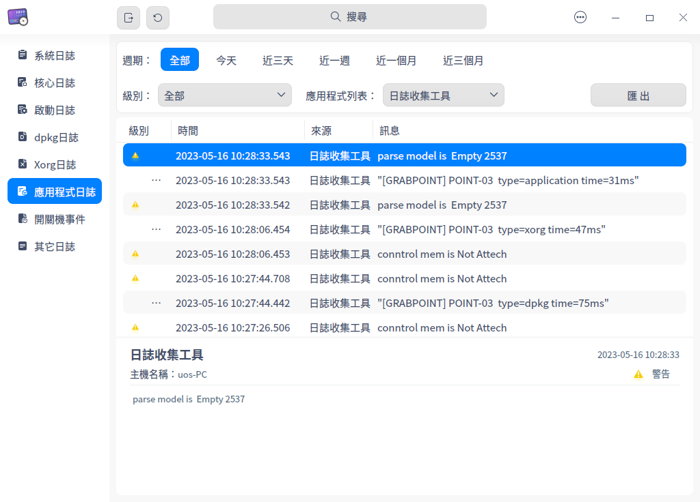
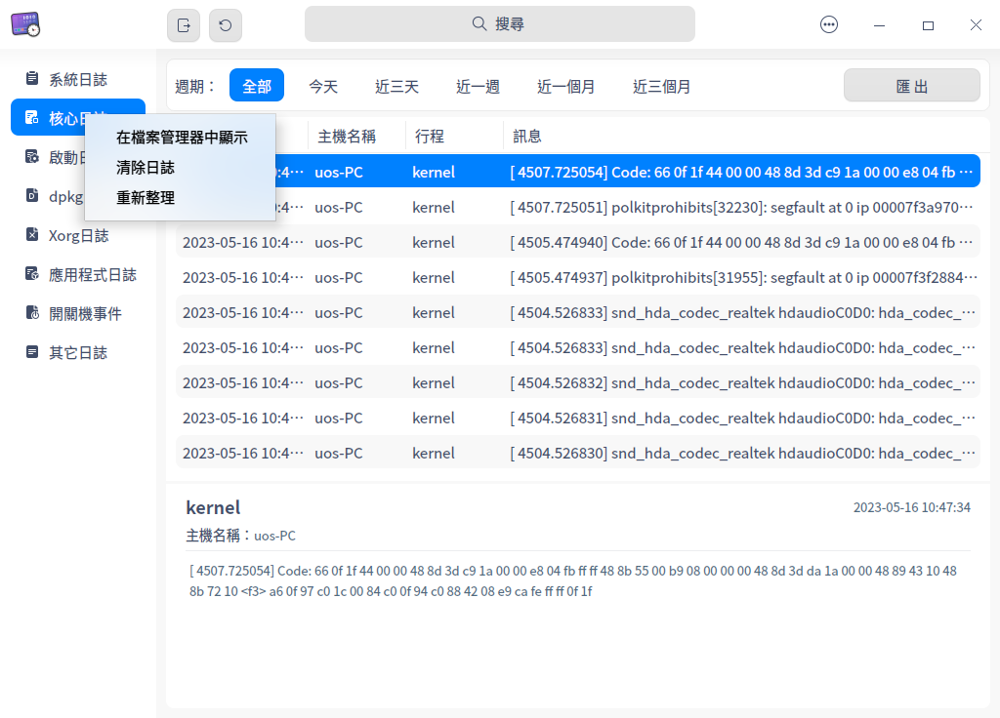

# 日誌收集工具|../common/deepin_log_viewer_96.svg|

## 概述

日誌收集工具是負責收集程式執行時所產生日誌的小工具，如作業系統和應用程式在啟動、執行等過程中的相關訊息。您可以透過分析詳細日誌訊息，快速的找到故障原因並解決問題。

## 使用入門

您可以透過以下方式執行或關閉日誌收集工具，或者建立捷徑。

### 執行日誌收集工具

1. 點擊任務欄上的  進入啟動器介面。
2. 上下滾動滑鼠滾輪瀏覽或透過搜尋找到 ，單擊執行日誌收集工具。
3. 右鍵點 ，您可以：
   - 點擊 **建立桌面捷徑**，在桌面建立捷徑。
   - 點擊 **釘選到Dock**，將應用程式固定到Dock。
   - 點擊 **開機啟動**，將應用程式添加到開機啟動項，在電腦開機時自動執行該應用程式。

### 關閉日誌收集工具

- 在日誌收集工具介面，點擊 ，關閉日誌收集工具。
- 右鍵單擊任務欄上的  圖示，選擇 **全部關閉** 來關閉日誌收集工具。
- 在日誌收集工具介面點擊 ，選擇 **離開** 來關閉日誌收集工具。

## 操作介紹

### 搜尋

1. 點擊，輸入關鍵字。

2. 輸入成功後，介面顯示搜尋結果。
3. 點擊  ，則清空搜尋內容。

### 篩選器

篩選器包括：**週期**、**級別**、**狀態**、**應用列表** 及 **事件類型**。
- 按週期篩選：按照日誌的生成的時間順序進行篩選的方式。

  選項包括：全部、今天、近三天、近一週、近一個月、近三個月，預設選項為全部。

  適用類型：除了啟動日誌沒有顯示時間外，其他類型的日誌都支援按週期篩選。

- 按級別篩選：按照事件的級別高低進行篩選的方式。

  選項包括：全部、緊急、嚴重警告、嚴重、錯誤、警告、注意、訊息、除錯，預設選項為訊息。

  適用類型：系統日誌、應用程式日誌。

- 按狀態列表篩選：

  僅適用於啟動日誌，選項包括：全部、OK、Failed，預設選項為全部。

- 按應用列表篩選：

  僅適用於應用程式日誌，對應用程式的log文件進行篩選，預設選項為第一個log文件。
  
- 按事件類型篩選：
  
  僅適用於開關機事件，選項包括：全部、登入、開機、關機，預設選項為全部。

### 查看日誌

#### 系統日誌

1. 在日誌收集工具介面，點擊 **系統日誌 **。
2. 介面顯示系統日誌列表，顯示欄位為級別、行程、時間和訊息。
3. 選中某條日誌後，列表下方會顯示該日誌的詳細訊息，包括日誌行程、主機名稱、行程號、級別、時間和詳細訊息。

#### 核心日誌

1. 在日誌收集工具介面，點擊 **核心日誌 **。
2. 介面顯示核心日誌列表，顯示欄位為時間、主機名稱、行程和訊息。
3. 選中某條日誌後，列表下方會顯示該日誌的詳細訊息，包括時間、主機名稱、行程和詳細訊息。
   
   > 說明：查看核心日誌會彈出授權對話框，請輸入使用者密碼完成授權。

#### 啟動日誌

1. 在日誌收集工具介面，點擊 **啟動日誌 **。
2. 介面顯示啟動日誌列表，顯示欄位為狀態和訊息。
3. 選中某條日誌後，列表下方會顯示該日誌的詳細訊息，包括主機名稱、狀態和詳細訊息。
   
   > 說明：查看啟動日誌會彈出授權對話框，請輸入使用者密碼完成授權。

#### dpkg日誌

1. 在日誌收集工具介面，點擊 **dpkg日誌 **。
2. 介面顯示dpkg日誌列表，顯示欄位為時間和訊息。
3. 選中某條日誌後，列表下方會顯示該日誌的詳細訊息，包括主機名稱、動作、時間和詳細訊息。

#### Xorg日誌

1. 在日誌收集工具介面，點擊 **Xorg日誌 **。
2. 介面顯示Xorg日誌列表，顯示欄位為時間和訊息。
3. 選中某條日誌後，列表下方會顯示該日誌的詳細訊息，包括主機名稱、時間和詳細訊息。

#### 應用程式日誌

1. 在日誌收集工具介面，點擊 **應用程式日誌 **。
2. 介面顯示應用程式日誌列表，顯示欄位為級別、時間、來源和訊息。
3. 選中某條日誌後，列表下方會顯示該日誌的詳細訊息，包括來源、主機名稱、時間、級別和詳細訊息。

#### 開關機事件

1. 在日誌收集工具介面，點擊 **開關機事件 **。
2. 介面顯示開關機事件列表，顯示欄位為事件類型、使用者名稱、時間和訊息。
3. 選中某條日誌後，列表下方會顯示該日誌的詳細訊息，包括主機名稱、事件類型、使用者名稱和詳細訊息。

### 匯出

使用者可以將目前日誌匯出為文件進行儲存，支援匯出的檔案格式為txt/doc/xls/html。

1. 在日誌收集工具介面，點擊**匯出**。
2. 彈出系統檔案管理器介面，編輯檔案名，選擇格式。
3. 點擊 **儲存**，完成操作。

### 在檔案管理器中顯示
1. 在日誌收集工具介面，滑鼠右鍵點擊左側導航欄中的日誌類型。

2. 選擇 **在檔案管理器中顯示**，打開並定位目前日誌所在的資料夾位置。

> 說明：**在檔案管理器中顯示** 僅適用於核心日誌、啟動日誌、dpkg日誌、Xorg日誌和應用程式日誌。

### 清除日誌

1. 在日誌收集工具介面，滑鼠右鍵點擊左側導航欄中的日誌類型。
2. 選擇 **清除日誌**，在彈出的對話框中點擊確定按鈕，清除目前的日誌內容。
3. 如果彈出認證視窗，請輸入密碼完成認證，即可完成操作。

> 說明：**清除日誌** 僅適用於核心日誌、啟動日誌、dpkg日誌、Xorg日誌和應用程式日誌。

### 重新整理日誌

1. 在日誌收集工具介面，滑鼠右鍵點擊左側導航欄中的日誌類型。
2. 選擇 **重新整理**，重新載入該日誌檔案，更新日誌列表。

## 主選單

在主選單中，您可以進行切換視窗主題，查看說明手冊等操作。

### 主題

視窗主題包含亮色主題、暗色主題和系統主題。

1. 在日誌收集工具介面，點擊 。
2. 點擊 **主題**，選擇一個主題顏色。

### 說明

查看說明手冊，進一步了解和使用日誌收集工具。

1. 在日誌收集工具介面，點擊 。
2. 點擊 **說明**。
3. 查看日誌收集工具的說明手冊。

### 關於

1. 在日誌收集工具介面，點擊 。
2. 點擊 **關於**。
3. 查看日誌收集工具的版本和介紹。

### 離開

1. 在日誌收集工具介面，點擊 。
2. 點擊 **離開**。

